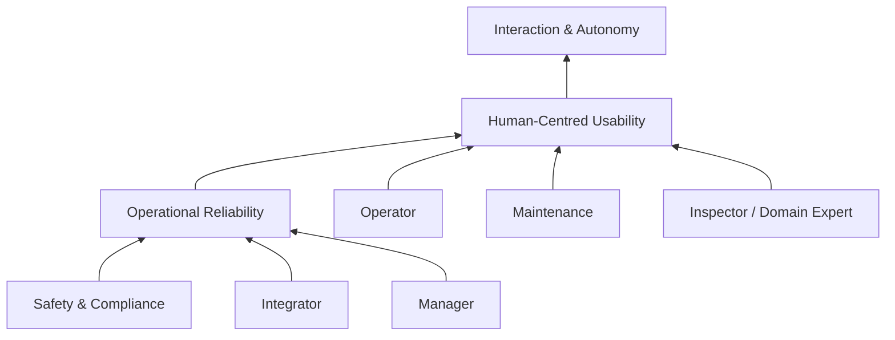

# RAISE-HRI

**Reliability and Safety in Industrial Human–Robot Interaction Environments**

Supporting repository for the HRI 2027 Industry White Paper:

> **Reliability First: Lessons from Industrial HRI in High-Stakes Environments**

RAISE-HRI turns the paper's central argument into a practical, navigable resource for researchers, system integrators, HRI practitioners, and industrial teams working with robots in high-stakes operational settings.

## Why RAISE-HRI?

Industrial HRI is not simply laboratory HRI transferred into a factory. Deployment changes the design problem: reliability dominates novelty, teams replace single-user assumptions, trust varies across roles and tasks, and safety compliance does not automatically produce usable systems.

RAISE-HRI organizes these issues around four transferable lessons:

1. **Design with the team, not for the individual.**
2. **Treat trust as task-contingent and role-dependent.**
3. **Close the aspirational–actual user gap.**
4. **Treat standards compliance as a baseline, not a usability guarantee.**

## Repository map

| Path | Purpose |
|---|---|
| [`docs/01-overview.md`](docs/01-overview.md) | Paper scope, motivation, and RAISE-HRI framing |
| [`docs/02-reliability-imperative.md`](docs/02-reliability-imperative.md) | Why reliability dominates design decisions in high-stakes deployment |
| [`docs/03-multi-operator-challenge.md`](docs/03-multi-operator-challenge.md) | Multi-role workflows, authority, information needs, and coordination |
| [`docs/04-trust-across-stakeholders.md`](docs/04-trust-across-stakeholders.md) | Role- and task-dependent trust |
| [`docs/05-four-transferable-lessons.md`](docs/05-four-transferable-lessons.md) | The four lessons in compact practitioner form |
| [`docs/06-high-stakes-deployment.md`](docs/06-high-stakes-deployment.md) | What makes an HRI environment high-stakes |
| [`practitioner/deployment-checklist.md`](practitioner/deployment-checklist.md) | Reliability-first deployment checklist |
| [`practitioner/stakeholder-map.md`](practitioner/stakeholder-map.md) | Template for identifying roles, authority, and information needs |
| [`practitioner/trust-calibration.md`](practitioner/trust-calibration.md) | Trust-calibration worksheet |
| [`practitioner/failure-review.md`](practitioner/failure-review.md) | Structured post-deployment failure review |
| [`practitioner/readiness-scorecard.md`](practitioner/readiness-scorecard.md) | Qualitative deployment-readiness scorecard |
| [`figures/README.md`](figures/README.md) | Figure concepts and generation prompts |
| [`references/evidence-map.md`](references/evidence-map.md) | Mapping from key references to claims in the paper |
| [`paper/`](paper/) | Manuscript source snapshot and bibliography |

## RAISE-HRI at a glance

The central idea is intentionally asymmetric: **higher-level interaction innovation should be built on top of safety, recoverability, and operational reliability**.

## Recommended reading path

**Academic readers:** Overview → Reliability → Multi-operator challenge → Trust → Evidence map.

**Industry practitioners:** Deployment checklist → Stakeholder map → Trust calibration → Failure review.

**Reviewers:** Overview → Four transferable lessons → Evidence map → Figures.

## Citation

If you use the repository, please cite the associated white paper. A machine-readable citation template is provided in [`CITATION.cff`](CITATION.cff).

## Status

This repository is designed as supporting material for an HRI 2027 Industry White Paper. It is a living practitioner resource and may evolve as additional deployment evidence and examples are added.

## License

See [`LICENSES/README.md`](LICENSES/README.md). The manuscript and written research content remain subject to the authors' publication and copyright terms. Repository code/templates can be separately licensed as indicated.
