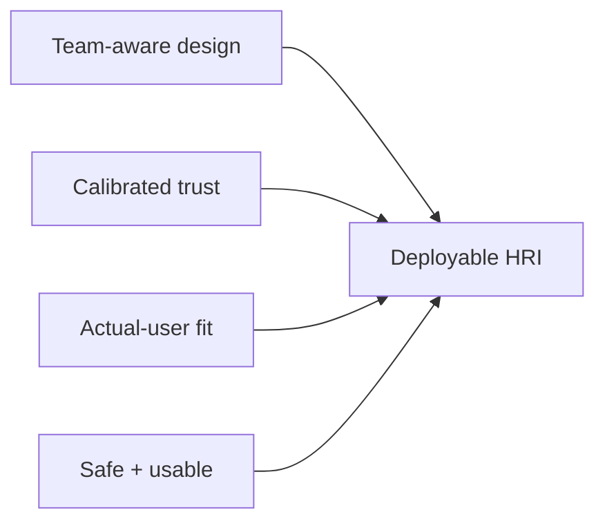

# 5. Four Transferable Lessons

[← Trust Across Stakeholders](04-trust-across-stakeholders.md) · [Next: High-Stakes Deployment →](06-high-stakes-deployment.md)

The paper condenses its deployment synthesis into four lessons.

## Lesson 1 — Design with the team, not for the individual

**Diagnostic question:** Who operates, observes, maintains, configures, approves, and depends on the robot?

**Action:** Map roles, information needs, authority boundaries, handoffs, and escalation paths before finalizing the interface architecture.

→ [Stakeholder map](../practitioner/stakeholder-map.md)

## Lesson 2 — Treat trust as task-contingent and role-dependent

**Diagnostic question:** Who must trust which robot capability for which task, and what happens if that trust is misplaced?

**Action:** Measure and support appropriate reliance by role and task rather than seeking a single global trust score.

→ [Trust calibration worksheet](../practitioner/trust-calibration.md)

## Lesson 3 — Close the aspirational–actual user gap

**Diagnostic question:** Who is claimed to be able to use the system, and who actually operates and troubleshoots it?

**Action:** Design training, support, recovery, and documentation around the actual operator profile.

Signals of a user gap include:

- frequent dependence on an integration engineer;
- undocumented recovery steps;
- configuration changes that only one specialist understands;
- operators avoiding features advertised as “easy to use”;
- successful demos that cannot be repeated after handover.

## Lesson 4 — Standards compliance ≠ usability

**Diagnostic question:** After the system is configured to meet safety requirements, is it still understandable and operationally usable?

**Action:** Treat compliance as a baseline and evaluate workload, interaction clarity, acceptance, throughput, and recovery within the safe operating envelope.

## Compact framework

## Use these lessons as diagnostics

The lessons are intentionally not framed as universal laws. They are prompts for design reviews, field trials, procurement discussions, and post-deployment analysis.
