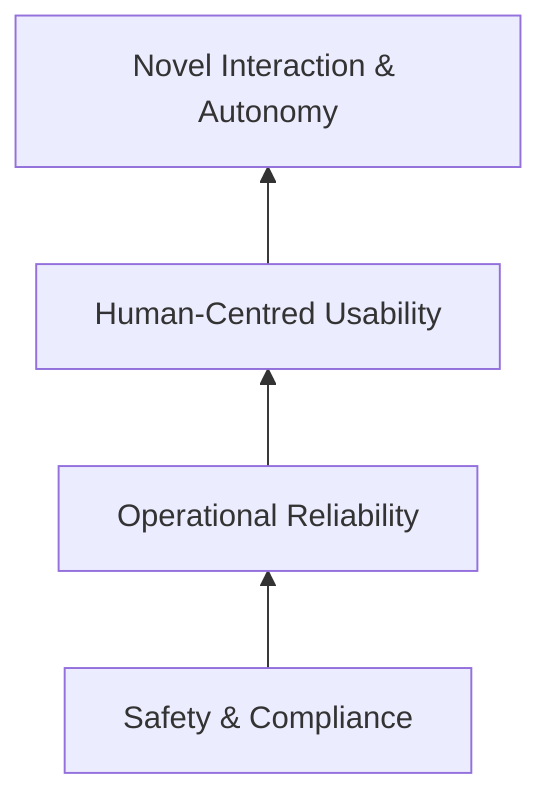
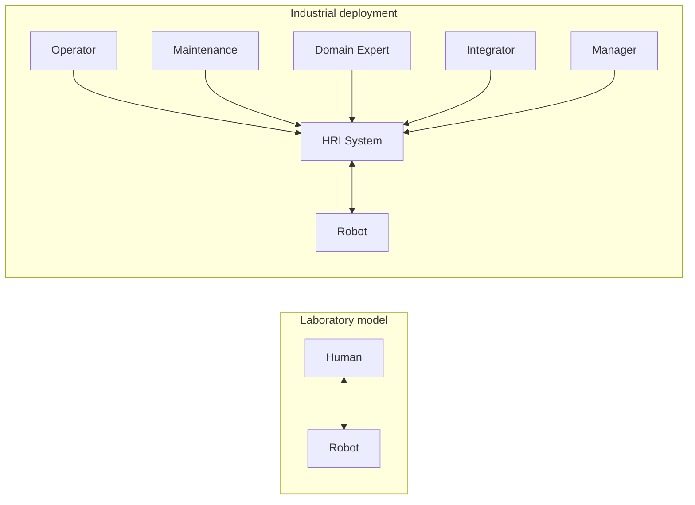
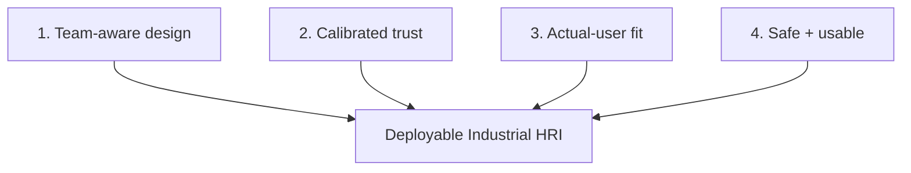

# Figures and Visual Assets

[← Repository home](../README.md)

These concepts are designed to support the white paper and repository without adding more prose to the manuscript.

## Figure A — Reliability-First Industrial HRI Stack

**Message:** interaction innovation is supported by—not substituted for—safety, reliability, and usability.

### Image-generation prompt

> Create a publication-quality academic infographic titled “Reliability-First Industrial HRI Deployment Stack”. Use a clean white background and simple vector shapes suitable for an ACM/IEEE paper. Show four vertically stacked layers from bottom to top: Safety & Compliance; Operational Reliability; Human-Centred Usability; Novel Interaction & Autonomy. Show upward dependency arrows. Add small side icons for Operator, Maintenance, Integration Engineer, Manager, and Inspector/Domain Expert. Use minimal text, high contrast, grayscale-compatible styling, and legible typography at one-column width.

## Figure B — Human–Robot Dyad vs Industrial Socio-Technical Team

**Message:** the interaction unit in deployment is often a team, not a dyad.

## Figure C — Four Deployment Checks

## Table concept — Research metric to deployment metric

| Research-oriented metric | Deployment-oriented counterpart |
|---|---|
| task success | successful operation without avoidable intervention |
| accuracy | defect/rework or decision-error impact |
| completion time | takt/cycle-time compatibility |
| trust score | appropriate reliance/intervention behavior |
| satisfaction | sustained use and acceptance |
| safety compliance | safe operation within usable workflow |
| learning time | training and support cost |
| autonomous success | success plus recoverability when autonomy fails |
